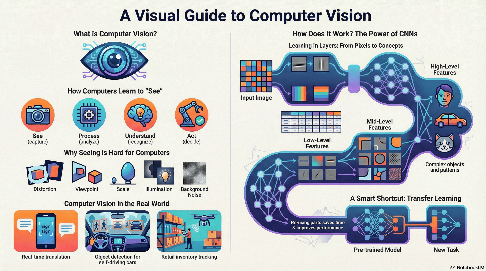

# 3.8 Computer Vision

## Lesson Overview

## Dependencies

Refer to the following markdown file for the respective sections of the class:

- [Self Studies](./studies.md)
- [Lesson](./lesson.md)
- [Assignment](./assignment.md)
- [Quiz](./quiz.md)
- [Reference](./reference.md)

## Lesson Objectives

At the end of the lesson, learners shall be able to:

* Explain the fundamentals of Computer Vision and apply **classical image processing techniques**, using Python libraries to analyze and enhance digital images.

* Construct and train **Convolutional Neural Networks (CNNs)** for image classification, utilizing essential architectural components and optimization strategies.

* Implement **Transfer Learning** strategies by adapting pre-trained models through feature extraction and fine-tuning to efficiently solve complex computer vision tasks.

## Lesson Plan

| Duration | What                    | How or Why                                               |
| -------- | ----------------------- | -------------------------------------------------------- |
| - 5mins  | Start zoom session      | So that learners can join early and start class on time. |
| 20 mins  | Activity                | Recap on self-study and prework materials.               |
| 40 mins  | Code-along              | Part 1: Introduction to CV and Image Processing.         |
|          | **1 HR MARK**           |
| 30 mins  | Code-along              | Part 2: CNN architecture.                                |
| 10 mins  | Break                   |                                                          |
| 20 mins  | Code-along              | Part 3: Training CNNs.                                   |
|          | **2 HR MARK**           |
| 50 mins  | Code-along              | Part 4: Transfer Learning and Pre-trained Models.        |
| 10 mins  | Briefing / Q&A          | Brief on references, assignment, quiz and Q&A.           |
|          | **END CLASS 3 HR MARK** |
